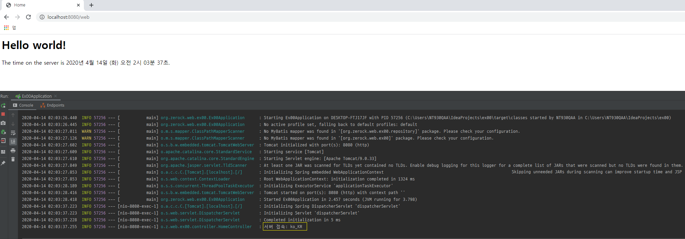
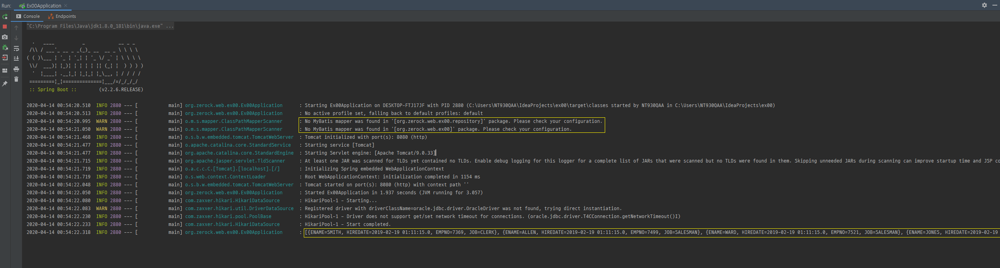

1주차
=====
* 프로젝트 세팅 및 테스트
	1. springboot(2.2.6), java(1.8), jsp, mybatis(1.3.2)
	2. junit(4.12)
* 보완점
	1. junit에 대한 이해 부족
	2. mysql 설치 실패로 oracle 사용
	3. git 공부 필요
- - -
## 목차
1. [Todo](#Todo)
2. [상세](#상세)
	1. [브라우저에 Hello world 띄워보기](#브라우저에-Hello-world-띄워보기)
	2. [MySQL 연결 테스트](#MySQL-연결-테스트)
	3. [DataSource 설정 테스트](#DataSource-설정-테스트)
	4. [MyBatis 연결 테스트](#MyBatis-연결-테스트)
3. [참고](#참고)

## Todo
- 1주차: 프로젝트 기본 설정
	1. [x] 브라우저에 Hello world 띄워보기
	2. [ ] MySQL 연결 테스트(jUnit)
	3. [ ] MySQL과의 연결 담당하는 DataSource 설정 테스트
	4. [ ] MyBatis 연결 테스트
- 추가
	1. [ ] 개별 브랜치 추가

##### [목차로 이동](#목차)

## 상세
### 브라우저에 Hello world 띄워보기
</br>

* [pom.xml](https://github.com/study-for-a-transfer/spring/blob/master/src/eom/ex00/pom.xml): 의존성 추가  
	```txt
	- spring-boot-starter-web
	- lombok -> slf4j?
	```
* [HomeController](https://github.com/study-for-a-transfer/spring/blob/master/src/eom/ex00/src/main/java/org/zerock/web/ex00/controller/HomeController.java): 요청url 설정
* [application.properties](https://github.com/study-for-a-transfer/spring/blob/master/src/eom/ex00/src/main/resources/application.properties)  
	```txt
	- JSP 설정
	  - 추가적으로 webapp/WEB-INF/jsp 폴더 구조 생성(스프링부트 특성상 직접 생성 필요)
	- 한글 깨짐 설정
	```
* [main 클래스](https://github.com/study-for-a-transfer/spring/commit/6f7a3a9f497d5b20475b84c14a1c694d11d1f718#diff-9c11a42ebd35a223c40839404938270bR12-R17): 주석 처리한 부분 실행

##### [목차로 이동](#목차)

### MySQL 연결 테스트


##### [목차로 이동](#목차)

### DataSource 설정 테스트


##### [목차로 이동](#목차)

### MyBatis 연결 테스트
</br>

##### [목차로 이동](#목차)

## 참고
* Spring-Boot & MyBatis
	1. [레퍼런스-1](https://brunch.co.kr/@ourlove/66)
	2. [레퍼런스-2](https://copycoding.tistory.com/275)
	3. [mybatis-spring-boot-autoconfigure](http://mybatis.org/spring-boot-starter/mybatis-spring-boot-autoconfigure/)
* MyBatis
	* [CDATA](https://epthffh.tistory.com/entry/Mybatis-%EC%97%90%EC%84%9C-CDATA-%EC%82%AC%EC%9A%A9%ED%95%98%EA%B8%B0)
	* [WHERE 1=1](https://jdm.kr/blog/7)


##### [목차로 이동](#목차)