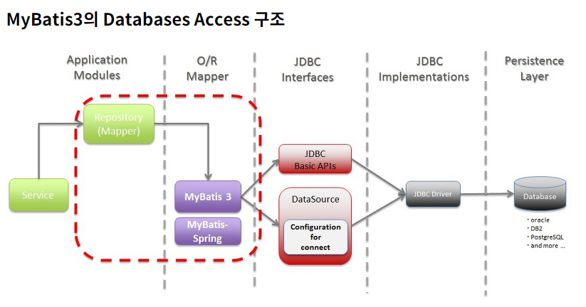
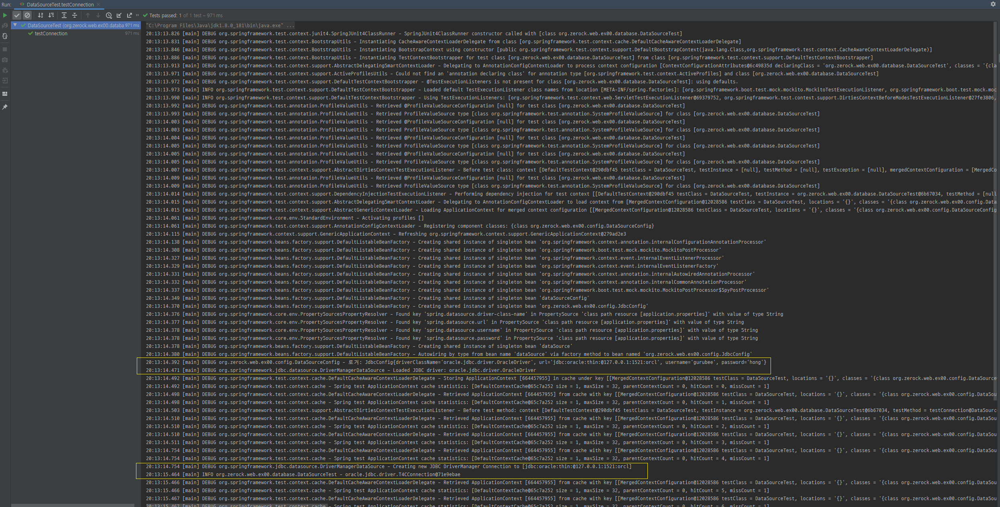

1주차
=====
* 프로젝트 세팅 및 테스트
	1. springboot(2.2.6), java(1.8), jsp, mybatis(1.3.2)
	2. junit(4.12)
* 보완점
	1. junit에 대한 이해 부족
	2. mysql 설치 실패로 oracle 사용
	3. git 공부 필요
- - -
## 목차
1. [Todo](#Todo)
2. [상세](#상세)
	1. [브라우저에 Hello world 띄워보기](#브라우저에-Hello-world-띄워보기)
	2. [DB 연결 테스트](#DB-연결-테스트)
		1. [MySQL 연결 테스트](#Oracle-연결-테스트)
		2. [DataSource 설정 테스트](#DataSource-설정-테스트)
		3. [MyBatis 연결 테스트](#MyBatis-연결-테스트)
3. [참고](#참고)

## Todo
- 1주차: 프로젝트 기본 설정
	1. [x] 브라우저에 Hello world 띄워보기
	2. [x] MySQL 연결 테스트(jUnit)
	3. [x] MySQL과의 연결 담당하는 DataSource 설정 테스트
	4. [ ] MyBatis 연결 테스트
- 추가
	1. [ ] 개별 브랜치 추가

##### [목차로 이동](#목차)

## 상세
### 브라우저에 Hello world 띄워보기
</br>

- - -
* [pom.xml](https://github.com/study-for-a-transfer/spring/commit/6f7a3a9f497d5b20475b84c14a1c694d11d1f718#diff-b0995e81632f71b9e1db001165a7124fR22-R31): 의존성 추가  
	```txt
	- spring-boot-starter-web
	- lombok -> slf4j?
	```
* [HomeController](https://github.com/study-for-a-transfer/spring/commit/6f7a3a9f497d5b20475b84c14a1c694d11d1f718#diff-55d3745e9663ea9d40e84e07a085cacdR14-R34): 요청url 설정
* [application.properties](https://github.com/study-for-a-transfer/spring/commit/6f7a3a9f497d5b20475b84c14a1c694d11d1f718#diff-eb7bbee74139df5b83f1050e25ee30fbR1-R8)  
	```txt
	- JSP 설정
	  - 추가적으로 webapp/WEB-INF/jsp 폴더 구조 생성(스프링부트 특성상 직접 생성 필요)
	- 한글 깨짐 설정
	```
* [main 클래스](https://github.com/study-for-a-transfer/spring/commit/6f7a3a9f497d5b20475b84c14a1c694d11d1f718#diff-9c11a42ebd35a223c40839404938270bR12-R17): 주석 처리한 부분 실행

##### [목차로 이동](#목차)

### DB 연결 테스트
총 세 부분으로 테스트를 진행한다(출처: [스프링에서 DB 접속하는 방법 정리](https://repacat.tistory.com/23)).

1. JDBC를 이용한 접속 테스트  
	```txt
	직접 드라이버 다운 후 추가(ojdbc6)
	```
2. Spring에서 DataSource 정의 후 이를 통한 접속 테스트  
	```txt
	pom.xml 의존성 추가
	  - spring-jdbc
	
	root-context.xml
	  - dataSource 설정(spring에서 jdbc 통해 DB 접속 가능 설정)
	    (spring-jdbc 모듈 사용)
	    -> org.springframework.jdbc.datasource.DriverManagerDataSource
	  - DataSource란 Connection Pool을 구현하기 위한 스펙을 정해놓은 인터페이스
	    -> org.apache.commons.dbcp2.BasicDataSource
	```
3. Spring에서 MyBatis 설정 후 이를 이용한 접속 테스트  
	```txt
	root-context.xml
	  1. sqlSessionFactory 설정
	    - sqlSession을 만드는 역할 담당(DataSource 필요)
	    -> org.mybatis.spring.SqlSessionFactoryBean
	  2. sqlSession 설정
	    - sql문을 실제로 호출해주는 객체
	    -> org.mybatis.spring.SqlSessionTemplate
	```

- - -
</br>

#### Oracle 연결 테스트
</br>

```java
import org.slf4j.Logger;
import org.slf4j.LoggerFactory;

import java.sql.Connection;
import java.sql.DriverManager;
import java.sql.SQLException;

public class OracleConnectionTest {
    private static final Logger LOGGER = LoggerFactory.getLogger(OracleConnectionTest.class);

    private static final String DRIVER = "oracle.jdbc.driver.OracleDriver";
    private static final String URL = "jdbc:oracle:thin:@127.0.0.1:1521:orcl";
    private static final String USER = "gurubee";
    private static final String PASSWORD = "hong";

    @Test
    public void testConnection() throws ClassNotFoundException {
        Class.forName(DRIVER);  // ClassNotFoundException

        try (Connection connection = DriverManager.getConnection(URL, USER, PASSWORD)) {
            LOGGER.info(String.valueOf(connection));
        } catch (SQLException e) {
            LOGGER.error(String.valueOf(e));
        }
    }
}
```

* jUnit을 이용해 JDBC 테스트 코드 작성
	1. Class.forName()으로 드라이버 로드
		* 자바 1.6 이상부터는 JDBC Driver 자동 등록(∴ 생략 가능)
	2. 커넥션 생성(java.sql.DriverManager)

이것이 책의 코드다. 나는 여기서 DB 정보를 설정 파일(application.properties)로 분리하고 싶었다.

```txt
# Database Info
spring.datasource.driver-class-name = oracle.jdbc.driver.OracleDriver
spring.datasource.url = jdbc:oracle:thin:@127.0.0.1:1521:orcl
spring.datasource.username = hj
spring.datasource.password = hj
```

그리고 이 설정 파일을 읽어올 설정 클래스를 빈으로 만들어 사용하고자 했다. 아래와 같다.

```java
// src/main/java
package org.zerock.web.ex00.config;

import lombok.Getter;
import lombok.Setter;
import org.springframework.beans.factory.annotation.Value;
import org.springframework.context.annotation.PropertySource;
import org.springframework.stereotype.Component;

@Getter
@Setter
@Component
@PropertySource("classpath:application.properties")
public class JdbcConfig {
    @Value("${spring.datasource.driver-class-name}")
    private String driverClassName;
    @Value("${spring.datasource.url}")
    private String url;
    @Value("${spring.datasource.username}")
    private String username;
    @Value("${spring.datasource.password}")
    private String password;

    // alt + ins
    @Override
    public String toString() {
        return "JdbcConfig{" +
                "driverClassName='" + driverClassName + '\'' +
                ", url='" + url + '\'' +
                ", username='" + username + '\'' +
                ", password='" + password + '\'' +
                '}';
    }
}
```

```java
// src/test/java
package org.zerock.web.ex00.database;

import org.junit.Test;
import org.junit.runner.RunWith;
import org.slf4j.Logger;
import org.slf4j.LoggerFactory;
import org.springframework.beans.factory.annotation.Autowired;
import org.springframework.test.context.ContextConfiguration;
import org.springframework.test.context.junit4.SpringJUnit4ClassRunner;
import org.zerock.web.ex00.config.JdbcConfig;

import java.sql.Connection;
import java.sql.DriverManager;
import java.sql.SQLException;

@RunWith(SpringJUnit4ClassRunner.class)
@ContextConfiguration(classes = {JdbcConfig.class})
public class OracleConnectionTest {
    private static final Logger LOGGER = LoggerFactory.getLogger(OracleConnectionTest.class);

    @Autowired
    private JdbcConfig jdbcConfig;

    @Test
    public void testConnection() throws ClassNotFoundException {
        LOGGER.info("확인: {}", jdbcConfig.toString());

        Class.forName(jdbcConfig.getDriverClassName());  // ClassNotFoundException

        try (Connection connection = DriverManager.getConnection(jdbcConfig.getUrl(), jdbcConfig.getUsername(), jdbcConfig.getPassword())) {
            LOGGER.info(String.valueOf(connection));
        } catch (SQLException e) {
            LOGGER.error(String.valueOf(e));
        }
    }
}
```

테스트 결과는 아래와 같이 잘 나옴을 확인할 수 있다.

</br>

다만 프로퍼티를 읽어올 때 좀 애를 먹었다. 설정 클래스(JdbcConfig)에서 프로퍼티를 제대로 못 읽어오는 문제가 있었는데 해결을 못했다. 코드는 아래와 같다(혹시 몰라 Bean 생성을 따로 해주기도 하였으나 해결이 안 됐다).

```java
@Getter
@Setter
@Configuration
@ConfigurationProperties(prefix = "spring.datasource")
public class JdbcConfig {
    @Value("${driver-class-name}")
    private String driverClassName;
    @Value("${url}")
    private String url;
    @Value("${username}")
    private String username;
    @Value("${password}")
    private String password;

    // alt + ins: toString 오버라이딩
    @Override
    public String toString() {
        return "JdbcConfig{" +
                "driverClassName='" + driverClassName + '\'' +
                ", url='" + url + '\'' +
                ", username='" + username + '\'' +
                ", password='" + password + '\'' +
                '}';
    }
}
```

- - -
* [OracleConnectionTest](https://github.com/study-for-a-transfer/spring/commit/6f7a3a9f497d5b20475b84c14a1c694d11d1f718#diff-8b92c1dc0a8783cc760f1933f8dba910R19-R29)
* Class.forName()
	* [Class.forName() 사용하기](http://blog.naver.com/PostView.nhn?blogId=ypark197&logNo=90093527507)
	* [JDBC Driver Manager란](https://ooz.co.kr/272)
	* [Class.forName()의 비밀 - 로드만 했을 뿐인데 getConnection()이 가능한 이유](https://pjh3749.tistory.com/250)
* 설정 파일 분리하기
	* [스프링 부트 커스텀 설정 프로퍼티 클래스 사용하기](https://javacan.tistory.com/entry/springboot-configuration-properties-class)
	* [스프링 @Value 어노테이션으로 properties 값 읽어오기](https://sas-study.tistory.com/273)
* 테스트
	1. @RunWith & @ContextConfiguration  
		```txt
		@RunWith
		  - https://stackoverflow.com/questions/25317009/what-does-this-do-runwithspringjunit4classrunner-class
		
		@ContextConfiguration
		  - 테스트 코드를 실행할 때 스프링이 로딩되도록 하는 부분
		  - 즉 자동으로 만들어줄 애플리케이션 컨텍스트의 설정 파일 위치 지정
		
		- 스프링의 spring-test 모듈은 위와 같은 간단한 애노테이션 설정으로 실제 스프링의 동작을 확인할 수 있는 좋은 방법
		- 특히 WAS 실행이 매번 상당히 많은 시간이 드는 환경에서는 필수적
		```
	2. @SpringBootTest

##### [목차로 이동](#목차)

#### DataSource 설정 테스트
</br>

DB 설정 클래스는 다음과 같다(JdbcConfig 클래스는 이전과 같다).

```java
// src/main/java
package org.zerock.web.ex00.config;

import org.slf4j.Logger;
import org.slf4j.LoggerFactory;
import org.springframework.context.annotation.Bean;
import org.springframework.context.annotation.Configuration;
import org.springframework.context.annotation.Import;
import org.springframework.jdbc.datasource.DriverManagerDataSource;

import javax.sql.DataSource;

@Configuration
@Import(JdbcConfig.class)
public class DataSourceConfig {
    private static final Logger LOGGER = LoggerFactory.getLogger(DataSourceConfig.class);

    @Bean
    public DataSource dataSource(JdbcConfig jdbcConfig) {
        LOGGER.debug("로거: {}", jdbcConfig.toString());
        DriverManagerDataSource dataSource = new DriverManagerDataSource();
        dataSource.setDriverClassName(jdbcConfig.getDriverClassName());
        dataSource.setUrl(jdbcConfig.getUrl());
        dataSource.setUsername(jdbcConfig.getUsername());
        dataSource.setPassword(jdbcConfig.getPassword());
        return dataSource;
    }
}
```

테스트 클래스는 아래와 같다.

```java
// src/test/java
package org.zerock.web.ex00.database;

import org.junit.Test;
import org.junit.runner.RunWith;
import org.slf4j.Logger;
import org.slf4j.LoggerFactory;
import org.springframework.beans.factory.annotation.Autowired;
import org.springframework.test.context.ContextConfiguration;
import org.springframework.test.context.junit4.SpringJUnit4ClassRunner;
import org.zerock.web.ex00.config.DataSourceConfig;

import javax.sql.DataSource;
import java.sql.Connection;

@RunWith(SpringJUnit4ClassRunner.class)
@ContextConfiguration(classes = DataSourceConfig.class)
public class DataSourceTest {
    private static final Logger LOGGER = LoggerFactory.getLogger(DataSourceTest.class);

    @Autowired
    private DataSource ds;  // DataSource & DriverManagerDataSource

    @Test
    public void testConnection() throws Exception {
        try (Connection con = ds.getConnection()) {
            LOGGER.info(String.valueOf(con));
        } catch (Exception e) {
            e.printStackTrace();
        }
    }
}
```

- - -
* ojdbc6 제거 테스트

##### [목차로 이동](#목차)

#### MyBatis 연결 테스트
MyBatis를 스프링과 함께 사용하려면 스프링의 애플리케이션 컨텍스트에 적어도 두 가지를 정의해줄 필요가 있다.

1. SqlSessionFactory
	* 데이터베이스와의 연결을 생성하고, 처리
2. Mapper Interface
	* 

</br>

- - -
* pom.xml  
	```txt
	- spring
	  -
	- spring-boot
	  -
	```

##### [목차로 이동](#목차)

## 참고
* Spring-Boot & MyBatis
	1. [Spring-Boot & MyBatis & Oracle](https://brunch.co.kr/@ourlove/66)
	2. [mybatis-spring-boot-autoconfigure](http://mybatis.org/spring-boot-starter/mybatis-spring-boot-autoconfigure/)
* MyBatis & SQL
	* [CDATA](https://epthffh.tistory.com/entry/Mybatis-%EC%97%90%EC%84%9C-CDATA-%EC%82%AC%EC%9A%A9%ED%95%98%EA%B8%B0)
	* [WHERE 1=1](https://jdm.kr/blog/7)
	* [Mapper XML Files: resultType & resultMap](https://araikuma.tistory.com/476)
* MyBatis & JDBC
	* [MyBatis, DataSource 설정](https://mangkyu.tistory.com/22)
	* [MyBatis란? 개념 및 구조](https://khj93.tistory.com/entry/MyBatis-MyBatis%EB%9E%80-%EA%B0%9C%EB%85%90-%EB%B0%8F-%ED%95%B5%EC%8B%AC-%EC%A0%95%EB%A6%AC)
* MyBatis & Mapper Interface
	* [MyBatis Mapper Interface란?](https://bigstupid.tistory.com/23)
	* [MyBatis에서 Mapper Interface로 고도화하기](https://mobicon.tistory.com/383)

##### [목차로 이동](#목차)