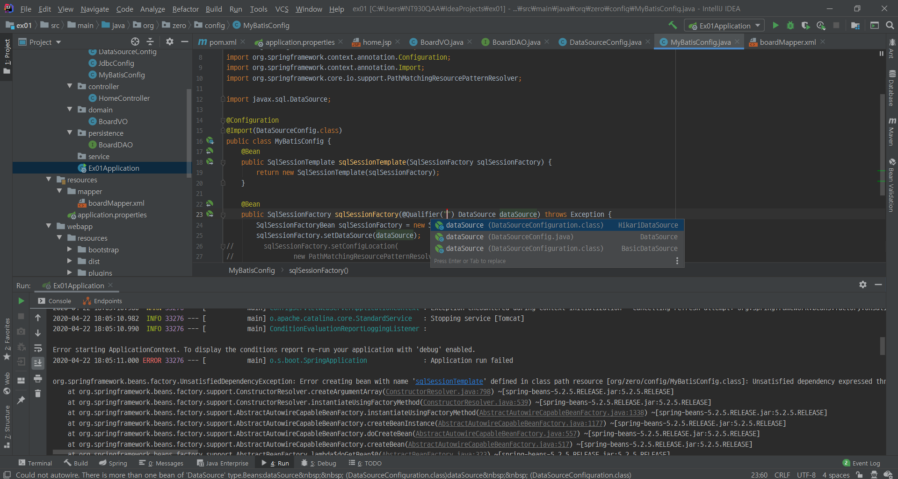
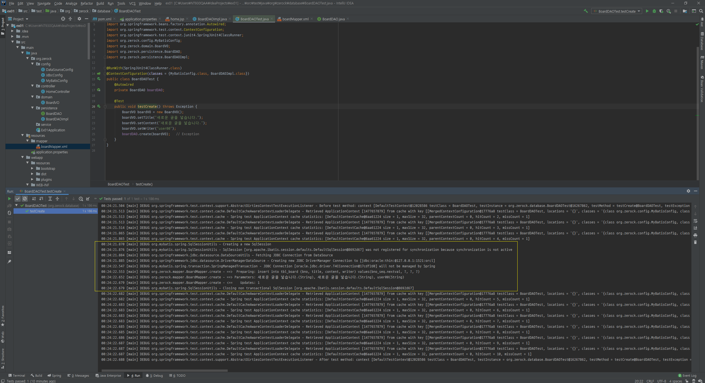

2주차
=====
* PART2: 기본적인 기능의 게시물 관리
	* 단순한 등록, 수정, 삭제, 조회와 리스트 기능의 게시판 만들기
	* 페이징 처리와 검색 기능
- - -
## 목차
1. [Todo](#Todo)
2. [상세](#상세)
	1. [프로젝트 설정](#프로젝트-설정)
	2. [게시물의 등록, 수정, 삭제, 조회](#CRUD)
	3. [페이징 처리](#페이징-처리)
	4. [검색 처리](#검색-처리)
3. [참고](#참고)

## Todo
- 2주차: 기본적인 기능의 게시물 관리
	1. [ ] 프로젝트 설정 
	2. [ ] 게시물의 등록, 수정, 삭제, 조회
	3. [ ] 페이징 처리
	4. [ ] 검색 처리

- - -
개발을 진행하기 위해 아래와 같은 단계별 목표를 갖고 진행하는 것이 좋다.

* STEP1
	* 등록할 수 있는 화면을 만들어주고 데이터베이스까지 등록되도록 작성
* STEP2
	* 등록된 결과를 확인하고, 화면은 목록 페이지로 이동하도록 전체 목록 기능 작성
* STEP3
	* 목록 작업이 완료되면 리스트의 특정 게시물을 선택해서 조회하는 화면을 작성
* STEP4
	* 조회 화면에서는 `Modify` 버튼을 이용해서 수정 작업 페이지로 이동 가능
* STEP5
	* 조회 화면에서는 `Delete` 버튼을 이용 직접 삭제 처리 가능
	* 삭제 후에는 다시 목록 페이지로 이동하게 되며 결과 확인 가능

##### [목차로 이동](#목차)

## 상세
### 프로젝트 설정
#### 환경
* spring-boot: 2.2.6.RELEASE
* java: 1.8
* junit: 4.12
* mybatis: 2.1.2
* oracle

##### [목차로 이동](#목차)
#### 에러
환경 설정하며 발생했던 에러를 기록한다.

1. Failed to instantiate [javax.sql.DataSource]  
	```txt
	- 에러 메세지
	org.springframework.beans.factory.BeanCreationException: 
		Error creating bean with name 'dataSource' defined in class path resource [org/zerock/config/DataSourceConfig.class]: 
		Bean instantiation via factory method failed; nested exception is org.springframework.beans.BeanInstantiationException: 
		Failed to instantiate [javax.sql.DataSource]: Factory method 'dataSource' threw exception; 
		nested exception is java.lang.IllegalStateException: 
		Could not load JDBC driver class [oracle.jdbc.driver.OracleDriver]
	
	- 설명
	  1. pom.xml에 commons-dbcp2 의존성 추가 후 아래와 같은 에러 발생
	    - Could not autowire. There is more than one bean of 'DataSource' type.
	        Beans: dataSource   (DataSourceConfig.java) 
	               dataSource   (DataSourceConfiguration.class) 
	  2. @Qualifier 권장 봤을 때 DataSource 구현체가 2개 있어서 발생하는 예외라 추측
	```
	</br>
2. org.xml.sax.SAXParseException  
	```txt
	- 에러 메세지
	org.springframework.beans.factory.UnsatisfiedDependencyException: 
		Error creating bean with name 'sqlSessionTemplate' defined in class path resource [org/zerock/config/MyBatisConfig.class]: 
		Unsatisfied dependency expressed through method 'sqlSessionTemplate' parameter 0; 
		nested exception is org.springframework.beans.factory.BeanCreationException: 
		Error creating bean with name 'sqlSessionFactory' defined in class path resource [org/zerock/config/MyBatisConfig.class]: 
		Bean instantiation via factory method failed; nested exception is org.springframework.beans.BeanInstantiationException: 
		Failed to instantiate [org.apache.ibatis.session.SqlSessionFactory]: 
		Factory method 'sqlSessionFactory' threw exception; nested exception is org.springframework.core.NestedIOException: 
		Failed to parse mapping resource: 'file [C:\Users\NT930QAA\IdeaProjects\ex01\target\classes\mapper\boardMapper.xml]'; 
		nested exception is org.apache.ibatis.builder.BuilderException: Error creating document instance.  
		Cause: org.xml.sax.SAXParseException; lineNumber: 12; columnNumber: 4; 예기치 않은 파일의 끝입니다.
	
	- 설명
	  1. mapper가 비어 있을 때 부트를 구동시키면 위와 같은 에러 발생
	  2. 매퍼 설정 파일 템플릿이 configuration가 아닌 mapper인지 확인 필요
	```
3. spring-boot automatically create the DataSource bean from the values provided in the properties file
	* [q](https://stackoverflow.com/questions/61364242/how-to-make-config-class-from-application-properties-in-spring-boot)
4. No qualifying bean of type 'org.apache.ibatis.session.SqlSession' available  
	```txt
	- 에러 메세지
	Caused by: org.springframework.beans.factory.UnsatisfiedDependencyException: 
		Error creating bean with name 'boardDAOImpl': Unsatisfied dependency expressed through field 'sqlSession'; 
		nested exception is org.springframework.beans.factory.NoSuchBeanDefinitionException: 
		No qualifying bean of type 'org.apache.ibatis.session.SqlSession' available: 
		expected at least 1 bean which qualifies as autowire candidate. 
		Dependency annotations: {@org.springframework.beans.factory.annotation.Autowired(required=true)}
	
	- 설명
	  1. DAO 테스트를 위해 BoardDAO를 주입(@Autowired) 받음
	  2. 테스트 환경에서 Bean 주입을 위해 @ContextConfiguration(classes = BoardDAOImpl.class) 추가
	  3. DAO에서 SqlSession를 사용하므로 SqlSessionTemplate 주입 필요(MyBatisConfig.class 추가)
	    - SqlSessionTemplate은 SqlSession의 구현체
	    - https://mybatis.org/spring/ko/sqlsession.html
	```
	</br>
5. .

##### [목차로 이동](#목차)

### CRUD


##### [목차로 이동](#목차)

### 페이징 처리


##### [목차로 이동](#목차)

### 검색 처리


##### [목차로 이동](#목차)

## 참고
* Maven
	1. [Maven - Parent and Child POM Example](https://howtodoinjava.com/maven/maven-parent-child-pom-example/)
	2. [The Spring Boot Starter Parent](https://www.baeldung.com/spring-boot-starter-parent)
	3. [spring-boot-starter 작성하기](https://meetup.toast.com/posts/152)
* Spring & Database
	1. [Spring JDBC](https://www.baeldung.com/spring-jdbc-jdbctemplate)
	2. [Spring Boot - DataSource configuration](https://howtodoinjava.com/spring-boot2/datasource-configuration/)
	3. [Spring Boot JDBC Example](https://www.concretepage.com/spring-boot/spring-boot-jdbc-example)
	4. [Spring Boot JDBC Examples](https://mkyong.com/spring-boot/spring-boot-jdbc-examples/)
* Spring & DataSource
	1. [Spring Boot - 복수 데이터 소스 설정](https://eblo.tistory.com/52)

##### [목차로 이동](#목차)
